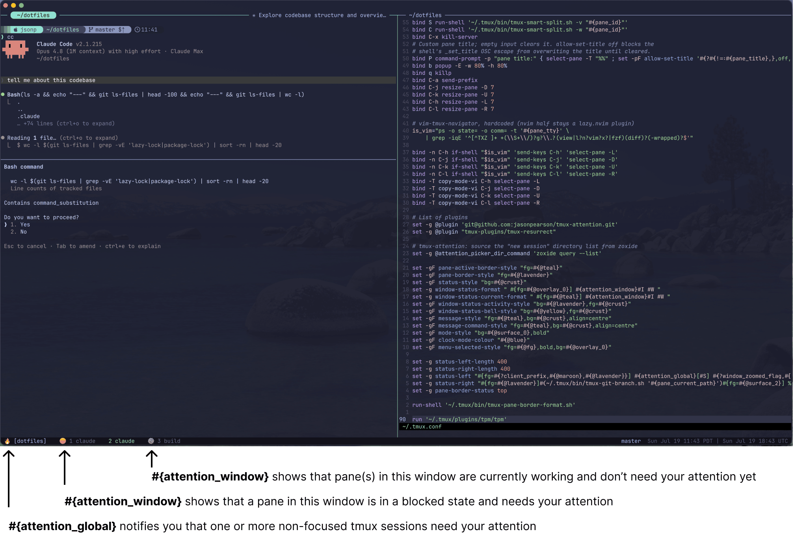
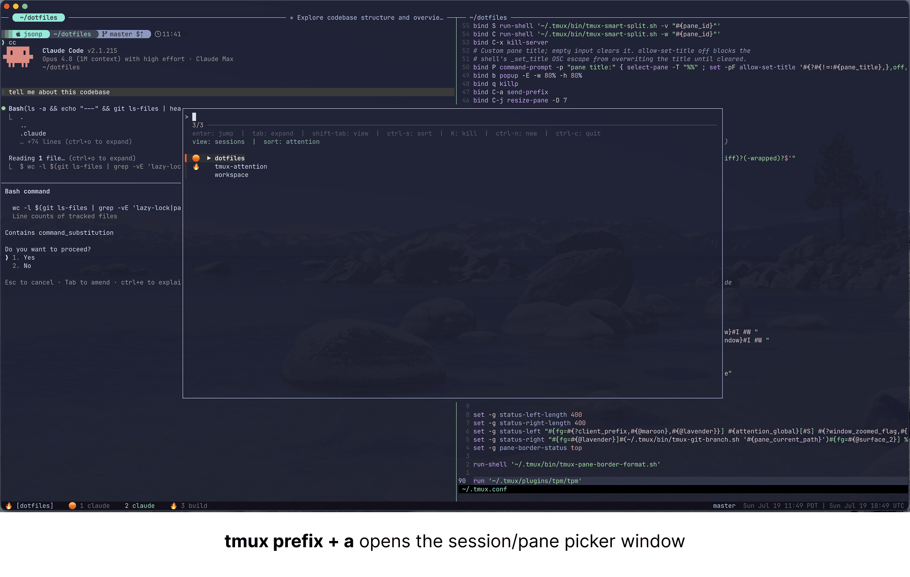

# 🔥 tmux-attention

Know which tmux sessions, windows, and panes needs you, at a glance.

tmux-attention tracks the state of work running in panes across sessions — coding agents, builds, test suites, any CLI command — and surfaces icons in your tmux status bar when pane(s) are ready for your attention. The moment you look at a pane, its notification downgrades itself.

- **Tool-agnostic** — anything that can run a shell command can integrate:
  agents via their hook systems, plain commands via a shell wrapper.
- **Theme-agnostic** — you place icons with format placeholders; works with
  any theme or status-bar setup.
- **Fully configurable** — every icon and key binding is a tmux option.
- **Zero maintenance** — state lives in tmux pane options, so it dies with
  the pane/server; no files, no cleanup, no daemons.

## Attention States

Each tmux pane in each tmux session has a single state:

| State     | Meaning                               | Default icon | Priority    |
| --------- | ------------------------------------- | ------------ | ----------- |
| `failed`  | finished unsuccessfully, not yet seen | ☠️           | 1 (highest) |
| `blocked` | needs input, approval, or a decision  | 🟠           | 2           |
| `done`    | finished, not yet seen                | 🔥           | 3           |
| `unknown` | state can't be classified confidently | ❓           | 4           |
| `working` | actively running                      | ⚙️           | 5           |
| `idle`    | finished/waiting and already seen     | (none)       | 6           |

To customize icons, see [Configuration](#configuration).

## Configuration

tmux-attention ships with the placeholders below. Add them to your `~/.tmux.conf` as desired.

| Placeholder            | Shows                                              | Suggested home                                          |
| ---------------------- | -------------------------------------------------- | ------------------------------------------------------- |
| `#{attention_pane}`    | this pane's state                                  | `pane-border-format`                                    |
| `#{attention_window}`  | highest-priority state in the window               | `window-status-format` / `window-status-current-format` |
| `#{attention_session}` | highest-priority state in the session              | session picker (built in); also usable in `status-left` |
| `#{attention_global}`  | highest-priority state across all _other_ sessions | `status-left`                                           |

The minimal `~/.tmux.conf` config below was used for screenshots in subsequent sections.

```tmux
# ~/.tmux.conf
set -g @plugin 'tmux-plugins/tpm'
set -g @plugin 'jasonpearson/tmux-attention'

set -ogq @base "#11111b"
set -ogq @subtle "#bac2de"
set -ogq @accent "#94e2d5"

set -g base-index 1
set -g status-left-length 400
set -g status-left ' #{attention_global}[#S] '
set -g status-style "bg=#{@base}"
set -g window-status-format " #[fg=#{@subtle}]#[bg=#{@base}] #{attention_window}#I #W"
set -g window-status-current-format ' #[fg=#{@accent}]#[bg=#{@base}]#{attention_window}#I #W'
set -g pane-border-format '#{attention_pane}#{b:pane_current_path} #{pane_title}'
set -g pane-border-status top

run '~/.tmux/plugins/tpm/tpm'   # keep this last; tmux-attention after any theme

```

After adding [TPM](https://github.com/tmux-plugins/tpm) or [tpack](https://github.com/tmuxpack/tpack) to `~/.tmux.conf`, open `tmux` and install with `prefix + I`.

tmux-attention dependencies:

- tmux ≥ 3.2
- [fzf](https://github.com/junegunn/fzf) ≥ 0.40

## At-a-glance status bar icons

<!-- Screenshot: a tmux status bar showing attention icons — e.g. 🟠 on one
     window, 🔥 on another, ⚙️ in the window list — plus a summary icon in
     status-left. Ideally across two or three sessions. -->



`prefix + a` open session picker/pane picker

`prefix + A` fuzzy-finds a directory and takes you to a session for it: an existing session of that name if there is one, otherwise a new session rooted in the directory and named after its leaf (`~/code/api` → `api`). Press **shift-tab** to flip to the session picker and back — a round-trip on the view key — and **ctrl-c** to quit back to the terminal from either. (Opened on its own with `prefix + a`, the session picker's **shift-tab** toggles its sessions/panes view as usual.)

`prefix + h` manually toggles the done attention state, which is useful for when you want to return to a pane.

## Session/Pane picker

<!-- Screenshot: the fzf popup opened with `prefix + a`, listing sessions
     with attention icons in the left gutter, one session expanded to show
     its windows/panes, and the two-line header (dimmed hotkeys, then
     view/sort state) visible. -->



`prefix + a` opens an fzf popup listing all sessions, each with its
aggregate icon in a left gutter and a `▶` expansion indicator.

- **enter** — jump to the selected session, window, or pane
- **tab** — expand/collapse the highlighted session in place.
- **shift-tab** — toggle the view between the sessions tree and a flat panes view
- **ctrl-s** — cycle the sort mode, shown in the header:
  - `attention` — failed → blocked → done → unknown → working, then quiet
    sessions; ties go to the latest activity (attaching, typing, or pane
    output), so an all-quiet list reads most-recently-used first (the
    default)
  - `name` — alphabetical

  The chosen mode is remembered until the tmux server restarts; the picker
  itself always reopens fully collapsed.

- **K** — kill whatever the selected row is — session, window, or pane. It
  asks to confirm first (anything but `y` aborts), then refreshes the list.
- **ctrl-n** — new session from a directory (below). The popup swaps to the
  directory picker in place; **shift-tab** (or **esc**) brings you back to the
  session list.
- **ctrl-c** — quit the picker straight back to the terminal, unwinding the
  directory round-trip in a single press (**esc** only steps back one level).

Movement stays fzf's own — arrow keys, `ctrl-j`/`ctrl-k`, and `ctrl-p`. Only
`ctrl-n` and `ctrl-c` are taken over (the new-session and quit keys above).
Every key is rebindable — see [Configuration](#configuration).

## Integration with the shell

Both pickers are also plain commands, so they can be aliased in your shell
rc. Inside tmux they switch the client; outside it they attach — which makes
them a way _in_ to tmux, not just a way around it:

```sh
alias tma='tmux-attention pick'   # find a session/window/pane, go to it
alias tmc='tmux-attention new'    # find a directory, get a session for it
tmux-attention new ~/code/api     # or skip the picker entirely
```

##### CLI reference

```
tmux-attention working  [pane_id]   # process started/resumed running
tmux-attention blocked  [pane_id]   # process needs input/approval (seen rule applies)
tmux-attention failed   [pane_id]   # process finished unsuccessfully (seen rule applies)
tmux-attention done     [pane_id]   # process finished (seen rule applies)
tmux-attention idle     [pane_id]   # process quiesced and nothing is pending
tmux-attention unknown  [pane_id]   # integration cannot classify the state
tmux-attention clear    [pane_id]   # remove tracking entirely
tmux-attention toggle   [pane_id]   # flip pane between done and idle (manual marking)
tmux-attention run [--] <command>   # wrapper: working → run command → done/failed

tmux-attention pick                 # session picker: find a target, go to it
tmux-attention new [dir]            # directory picker: get a session for a directory
```

`pane_id` defaults to `$TMUX_PANE`. `toggle` (bound to `prefix + h` by
default) bypasses the seen rule so you can mark the pane you're looking at
and get reminded about it after you switch away.

`pick` and `new` are the interactive pair, and the exception to the
exits-0-silently rule above: they are useful outside tmux, where they attach
instead of switching the client.

## Integration with Claude Code

`~/.claude/settings.json`:

```json
{
  "hooks": {
    "UserPromptSubmit": [
      {
        "matcher": "",
        "hooks": [
          {
            "type": "command",
            "command": "~/.tmux/plugins/tmux-attention/bin/tmux-attention working"
          }
        ]
      }
    ],
    "PermissionRequest": [
      {
        "matcher": "",
        "hooks": [
          {
            "type": "command",
            "command": "~/.tmux/plugins/tmux-attention/bin/tmux-attention blocked"
          }
        ]
      }
    ],
    "Stop": [
      {
        "matcher": "",
        "hooks": [
          {
            "type": "command",
            "command": "~/.tmux/plugins/tmux-attention/bin/tmux-attention done"
          }
        ]
      }
    ],
    "SessionEnd": [
      {
        "matcher": "",
        "hooks": [
          {
            "type": "command",
            "command": "~/.tmux/plugins/tmux-attention/bin/tmux-attention clear"
          }
        ]
      }
    ]
  }
}
```

## All tmux options

Every option, shown set to its default:

```tmux
# state icons
set -g @attention_icon_blocked '🟠'
set -g @attention_icon_failed  '☠️'
set -g @attention_icon_done    '🔥'
set -g @attention_icon_unknown '❓'
set -g @attention_icon_working '⚙️'
set -g @attention_icon_idle    ''

# downgrade unrefreshed `working` to `unknown` after N seconds
set -g @attention_stale_timeout 'off'

# key bindings (prefix table)
set -g @attention_toggle_key 'h'
set -g @attention_picker_key 'a'
set -g @attention_new_key    'A'      # directory picker -> session

# keys inside the picker (fzf key names)
set -g @attention_picker_kill_key   'K'      # kills the selected session/window/pane (confirms first)
set -g @attention_picker_new_key    'ctrl-n' # swaps to the directory picker
set -g @attention_picker_expand_key 'tab'
set -g @attention_picker_view_key   'shift-tab' # picker: tree <-> panes; dir <-> session round-trip
set -g @attention_picker_sort_key   'ctrl-s'
set -g @attention_picker_cancel_key 'ctrl-c'    # quit the picker back to the terminal

# where the directory picker looks (see "Directory picker")
set -g @attention_picker_dir_root    "$HOME"
set -g @attention_picker_dir_hidden  'on'     # descend into dotted directories
set -g @attention_picker_dir_skip    '.git,node_modules,Library,.cache,.Trash,.local,.npm,.cargo,.rustup,.gradle,.m2,.venv,venv,__pycache__,target,dist,build,.next'
set -g @attention_picker_dir_command ''       # set to replace the source entirely

# picker view (sessions | panes) and sort mode (attention | name)
# at server start, and the session expansion indicators
set -g @attention_picker_view           'sessions'
set -g @attention_picker_sort           'attention'
set -g @attention_picker_collapsed_icon '▶'
set -g @attention_picker_expanded_icon  '▼'
```

## License

[MIT](LICENSE)
