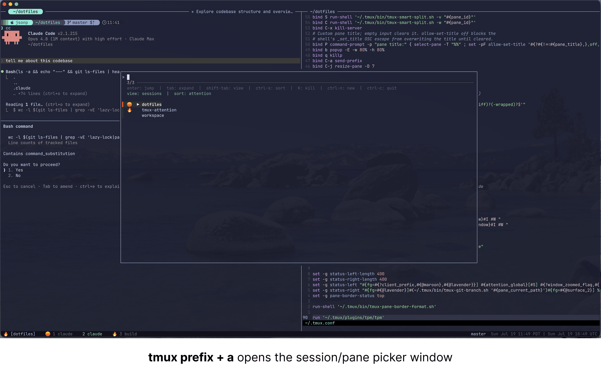

# 🔥 tmux-attention

Know which tmux sessions, windows, and panes need you, at a glance.

tmux-attention tracks the state of work running in panes across sessions — coding agents, builds, test suites, any CLI command — and surfaces icons in your tmux status bar when pane(s) are ready for your attention. The moment you look at a pane, its notification downgrades itself.

- **Tool-agnostic** — anything that can run a shell command can integrate:
  agents via their hook systems, plain commands via a shell wrapper.
- **Theme-agnostic** — place native tmux icon formats in any theme or status bar.
- **Optional tmux UI** — customize icons and define your own bindings.
- **Zero maintenance** — state lives in tmux pane options, so it dies with
  the pane/server; no files, no cleanup, no daemons.

## Attention States

Each tmux pane in each tmux session has a single state:

| State     | Meaning                               | Default icon | Priority    |
| --------- | ------------------------------------- | ------------ | ----------- |
| `failed`  | finished unsuccessfully, not yet seen | ☠️           | 1 (highest) |
| `blocked` | needs input, approval, or a decision  | 🟠           | 2           |
| `done`    | finished, not yet seen                | 🔥           | 3           |
| `unknown` | state can't be classified confidently | ❓           | 4           |
| `working` | actively running                      | ⚙️           | 5           |
| `idle`    | finished/waiting and already seen     | (none)       | 6           |

Untracked panes do not contribute to aggregates. `clear` removes tracking;
`idle` keeps it. Recording blocked/failed/done on a focused pane records idle
instead; focusing a notifying pane also idles it. An unanswered blocked state
is not overwritten by done/failed. `toggle` bypasses the seen rule for manual
marking.

Seen-rule hooks and native tmux formats register automatically on valid state
use. Neither state commands nor plugin loading changes your theme or key
bindings. Help and outside-tmux state no-ops do not set up hooks/formats.

To customize icons, see [All tmux options](#all-tmux-options).

## Optional tmux UI

Place these native tmux formats in your existing theme. Use the `T:` modifier
to expand both formats and time substitutions, including the current time used
for stale-state rendering. No shell helper is involved:

| Format | Shows | Suggested home |
| --- | --- | --- |
| `#{T:@attention_pane}` | this pane's state | `pane-border-format` |
| `#{T:@attention_window}` | highest-priority state in the window | window status formats |
| `#{T:@attention_session}` | highest-priority state in the session | `status-left` |
| `#{T:@attention_global}` | highest-priority state across all **other** sessions | `status-left` or `status-right` |

For example, in `tmux.conf`:

```tmux
set -g status-left ' #{T:@attention_global}[#S] #{T:@attention_session}'
set -g window-status-format ' #{T:@attention_window}#I:#W '
set -g window-status-current-format ' #{T:@attention_window}#I:#W '
set -g pane-border-format '#{T:@attention_pane}#{b:pane_current_path} #{pane_title}'
set -g pane-border-status top
```

The formats register automatically on state use. Until then they expand to
blank; before tracked work, that is expected. Rendering uses native tmux
expressions, with no `#()` shell jobs or installation paths embedded in your
theme. Registration is idempotent and preserves other plugins' hooks.
Subsequent state use repairs attention hooks removed by a config reload. After
an upgrade, run a state command against each existing server before removing
the old installation, so stored seen-hook paths are refreshed.

For registration before the first state command, optionally load through
TPM/tpack with `set -g @plugin 'jasonpearson/tmux-attention'`. The
`attention.tmux` adapter registers the same formats and seen hooks; it does
not rewrite themes or install bindings.

### Opt-in bindings

No keys are installed automatically. Add ordinary tmux bindings, or choose
your own keys (the executable must be on tmux's PATH):

```tmux
bind-key a display-popup -E -d '#{pane_current_path}' -w 60% -h 60% 'tmux-attention pick'
bind-key A display-popup -E -d '#{pane_current_path}' -w 60% -h 60% 'tmux-attention new'
bind-key h run-shell 'tmux-attention toggle "#{pane_id}"'
```

Requires Bash ≥ 3.2 and tmux ≥ 3.3. Interactive navigation also requires
[fzf](https://github.com/junegunn/fzf) ≥ 0.40 — ≥ 0.48 for the directory
picker's built-in walk, or set `@attention_picker_dir_command` to supply
the directories yourself.

## At-a-glance status bar icons


`prefix + a` opens the session/pane picker

`prefix + A` fuzzy-finds a directory and takes you to a session for it: an existing session of that name if there is one, otherwise a new session rooted in the directory and named after its leaf (`~/code/api` → `api`). Press **shift-tab** to flip to the session picker and back — a round-trip on the view key — and **ctrl-c** to quit back to the terminal from either. (Opened on its own with `prefix + a`, the session picker's **shift-tab** toggles its sessions/panes view as usual.)

`prefix + h` manually toggles the done attention state, which is useful for when you want to return to a pane.

## Session/Pane picker



`prefix + a` opens an fzf popup listing all sessions, each with its
aggregate icon in a left gutter and a `▶` expansion indicator.

- **enter** — jump to the selected session, window, or pane
- **tab** — expand/collapse the highlighted session in place.
- **shift-tab** — toggle the view between the sessions tree and a flat panes view
- **ctrl-s** — cycle the sort mode, shown in the header:
  - `attention` — failed → blocked → done → unknown → working, then quiet
    sessions; ties go to the latest activity (attaching, typing, or pane
    output), so an all-quiet list reads most-recently-used first (the
    default)
  - `name` — alphabetical

  The chosen mode is remembered until the tmux server restarts; the picker
  itself always reopens fully collapsed.

- **K** — kill whatever the selected row is — session, window, or pane. It
  asks to confirm first (anything but `y` aborts), then refreshes the list.
- **ctrl-n** — new session from a directory (below). The popup swaps to the
  directory picker in place; **shift-tab** brings you back to the session list.
- **ctrl-c** — quit the picker back to the terminal (**esc** does the same).

Movement stays fzf's own — arrow keys, `ctrl-j`/`ctrl-k`, and `ctrl-p`. Only
`ctrl-n` and `ctrl-c` are taken over (the new-session and quit keys above).
Every key is rebindable — see [All tmux options](#all-tmux-options).

## Integration with the shell

Both pickers are also plain commands, so they can be aliased in your shell
rc — and run bare on a terminal, `tmux-attention` _is_ the picker. Inside
tmux they switch the client; outside it they attach — which makes them a way
_in_ to tmux, not just a way around it:

```sh
alias tm='tmux-attention'              # the picker: a directory, or shift-tab for sessions
alias tma='tmux-attention pick'        # straight to the session/window/pane list
alias tmc='tmux-attention new "$PWD"'  # session for the current directory
```

Bare is gated on an interactive terminal: run from a script or hook with no
command, `tmux-attention` prints its usage instead of grabbing the terminal.

##### CLI reference

```
tmux-attention working  [pane_id]   # process started/resumed running
tmux-attention blocked  [pane_id]   # process needs input/approval (seen rule applies)
tmux-attention failed   [pane_id]   # process finished unsuccessfully (seen rule applies)
tmux-attention done     [pane_id]   # process finished (seen rule applies)
tmux-attention idle     [pane_id]   # process quiesced and nothing is pending
tmux-attention unknown  [pane_id]   # integration cannot classify the state
tmux-attention clear    [pane_id]   # remove tracking entirely
tmux-attention toggle   [pane_id]   # flip pane between done and idle (manual marking)
tmux-attention run [--] <command>   # wrapper: working → run command → done/failed

tmux-attention                      # no command on a terminal: the picker (as `new`)
tmux-attention pick                 # session picker: find a target, go to it
tmux-attention new [dir]            # directory picker: get a session for a directory
```

`pane_id` defaults to `$TMUX_PANE`. `toggle` (bound to `prefix + h` in the
opt-in example) bypasses the seen rule so you can mark the pane you're looking at
and get reminded about it after you switch away.

`pick` and `new` are the interactive pair, and the exception to the
exits-0-silently rule above: they are useful outside tmux, where they attach
instead of switching the client.

## Integration with Claude Code

`~/.claude/settings.json`:

```json
{
  "hooks": {
    "UserPromptSubmit": [
      {
        "matcher": "",
        "hooks": [
          {
            "type": "command",
            "command": "~/.tmux/plugins/tmux-attention/bin/tmux-attention working"
          }
        ]
      }
    ],
    "PermissionRequest": [
      {
        "matcher": "",
        "hooks": [
          {
            "type": "command",
            "command": "~/.tmux/plugins/tmux-attention/bin/tmux-attention blocked"
          }
        ]
      }
    ],
    "Stop": [
      {
        "matcher": "",
        "hooks": [
          {
            "type": "command",
            "command": "~/.tmux/plugins/tmux-attention/bin/tmux-attention done"
          }
        ]
      }
    ],
    "SessionEnd": [
      {
        "matcher": "",
        "hooks": [
          {
            "type": "command",
            "command": "~/.tmux/plugins/tmux-attention/bin/tmux-attention clear"
          }
        ]
      }
    ]
  }
}
```

## All tmux options

Every option, shown set to its default. Each valid state command or plugin
load fills in unset icon defaults. Global overrides remain live: change them
before or after registration, without regenerating formats. An explicitly
empty icon hides that state's icon; idle is intentionally empty by default.
To reset an icon, unset its option (for example, `tmux set -gu
@attention_icon_done`); the next state command or plugin load restores the
default.

```tmux
# state icons
set -g @attention_icon_blocked '🟠'
set -g @attention_icon_failed  '☠️'
set -g @attention_icon_done    '🔥'
set -g @attention_icon_unknown '❓'
set -g @attention_icon_working '⚙️'
set -g @attention_icon_idle    ''

# Render working as unknown after N seconds without an update; no state rewrite.
set -g @attention_stale_timeout 'off'

# keys inside the picker (fzf key names)
set -g @attention_picker_kill_key   'K'      # kills the selected session/window/pane (confirms first)
set -g @attention_picker_new_key    'ctrl-n' # swaps to the directory picker
set -g @attention_picker_expand_key 'tab'
set -g @attention_picker_view_key   'shift-tab' # picker: tree <-> panes; dir <-> session round-trip
set -g @attention_picker_sort_key   'ctrl-s'
set -g @attention_picker_cancel_key 'ctrl-c'    # quit the picker back to the terminal

# where the directory picker (prefix + A) looks. fzf walks the tree itself,
# so dir_root is the knob that matters most — a project root walks in well
# under a second, a whole home directory takes a few. Names in dir_skip are
# never descended into (single path components only); an empty list descends
# into everything. Setting dir_command replaces the source entirely, and
# root/hidden/skip stop applying — they configure a walk no longer happening.
set -g @attention_picker_dir_root    "$HOME"
set -g @attention_picker_dir_hidden  'on'     # descend into dotted directories
set -g @attention_picker_dir_skip    '.git,node_modules,Library,.cache,.Trash,.local,.npm,.cargo,.rustup,.gradle,.m2,.venv,venv,__pycache__,target,dist,build,.next'
set -g @attention_picker_dir_command ''       # e.g. 'zoxide query --list'

# picker view (sessions | panes) and sort mode (attention | name)
# at server start, and the session expansion indicators
set -g @attention_picker_view           'sessions'
set -g @attention_picker_sort           'attention'
set -g @attention_picker_collapsed_icon '▶'
set -g @attention_picker_expanded_icon  '▼'
```

## Migrating native status formats

- Upgrade tmux to **3.3 or newer**. Native aggregation needs its larger format
  nesting limit; tmux 3.2 can silently misrender icons in nested theme formats.
- Replace `#{attention_pane}`, `#{attention_window}`, `#{attention_session}`,
  and `#{attention_global}` with `#{T:@attention_pane}`,
  `#{T:@attention_window}`, `#{T:@attention_session}`, and `#{T:@attention_global}`.
- Replace `@attention_picker_key`, `@attention_new_key`, and
  `@attention_toggle_key` with your own [tmux bindings](#opt-in-bindings).
  Remove old generated bindings with `unbind-key a` / `unbind-key A` /
  `unbind-key h` if they still belong to tmux-attention, before adding replacements.
- Reload your original theme/status definitions with the new formats to remove
  persisted generated `#()` jobs, baked-in icons, and old installation paths.
  Reloading does not automatically undo settings omitted from your config;
  explicitly reset any leftover formats/bindings you no longer want.

## License

[MIT](LICENSE)
