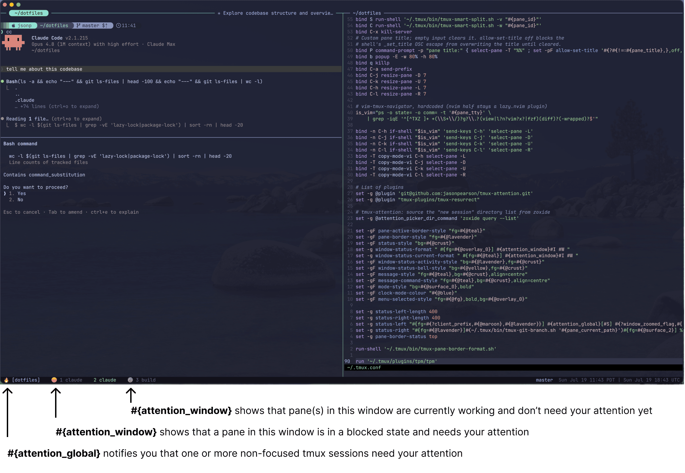

# 🔥 tmux-attention

A small CLI for navigating tmux and knowing which work needs you.

Run it from any terminal: choose a session, pane, or project directory. Inside
tmux it switches the client; outside it attaches. Track agents, builds, tests,
or any command, and the navigator shows what needs attention. Looking at a
notifying pane clears its notification automatically.

- **Immediately usable** — no plugin manager, setup command, or theme required.
- **Tool-agnostic** — record states from agent hooks or wrap a shell command.
- **Optional tmux UI** — place icons in your existing theme and define your own bindings.
- **No daemon or persistent state files** — state lives in tmux pane options and dies with
  the pane/server.

## Install

Requires Bash ≥ 3.2 and tmux ≥ 3.3. The live pane picker requires
[fzf](https://github.com/junegunn/fzf) ≥ 0.73. Session/directory navigation needs
fzf ≥ 0.40 with a custom directory source, or ≥ 0.48 for the default walker.
`column` is optional for aligning the panes table. Direct directory entry,
`jump`, state commands, and `run` do not need fzf.

### Mise

```sh
mise use -g tmux fzf github:jasonpearson/tmux-attention@0.2.0
tmux-attention
```

Or add to `~/.config/mise/config.toml` and run `mise install`:

```toml
[tools]
"github:jasonpearson/tmux-attention" = "0.2.0"
# Keep your existing tmux/fzf version pins, or add them if missing.
```

The GitHub backend installs our universal release archive and discovers its
`bin/` directory. There is no custom mise plugin or postinstall setup. These
commands require a **published release asset**, not merely a Git tag. For
unreleased changes, use a main snapshot or local checkout below.

For noninteractive callers without mise's activated PATH, use the stable shim
`~/.local/share/mise/shims/tmux-attention` (with the default mise data directory),
or `mise exec -- tmux-attention …`. Do not hardcode a versioned install path.

#### Unreleased main with mise

Install a snapshot of `main` and select it globally:

```sh
mise use -g 'http:tmux-attention[url=https://github.com/jasonpearson/tmux-attention/archive/refs/heads/main.tar.gz,strip_components=1,bin_path=bin]@main'
```

Rerun with `--force` to update; it does not update automatically. Remove any
`github:jasonpearson/tmux-attention` entry from `~/.config/mise/config.toml`
so only one installation is selected.

#### Local checkout with mise

```sh
~/repos/tmux-attention/scripts/link-local.sh
```

The helper links its checkout as `github:jasonpearson/tmux-attention@local`
and runs `mise use -g` to select it in your global mise config. It works from
any directory; rerunning it replaces the previous `local` link. Source edits
are immediately available without reinstalling.

To return to the release:

```sh
mise use -g github:jasonpearson/tmux-attention@0.2.0
```

### Source or release archive

Keep `bin/`, `scripts/`, and `VERSION` together and add `bin/` to PATH:

```sh
git clone https://github.com/jasonpearson/tmux-attention.git ~/.local/share/tmux-attention
export PATH="$HOME/.local/share/tmux-attention/bin:$PATH"
```

Alternatively, symlink the executable into a directory on PATH; executable
symlinks are resolved. Do not copy the executable without its supporting files.
TPM/tpack remains supported for the [optional tmux UI](#optional-tmux-ui), but
is not required to install or use the CLI. Choose one installation to maintain.

## Quick start

```sh
alias t='tmux-attention'

t                    # choose an existing session or a project directory
t panes              # choose a pane by attention priority
t jump               # focus the highest-ranked ordinary pane (no picker)
t .                  # create/reuse the current directory's session
t ~/code/api          # create/reuse the api session
t run -- make test    # working -> done/failed, preserving the exit code
```

Bare invocation always opens the **combined session/directory picker**:
existing sessions first, then directories. Use **`tmux-attention panes`** for
the separate flat pane picker. **Esc** or **ctrl-c** quits either picker.
Browsing and cancelling on a cold start does not create a tmux server or a
hidden bootstrap session. The CLI runs in your terminal; it never creates a
popup itself.

Directory arguments are normalized first (`.`, `..`, trailing slashes, and
symlinks work). The session is named after the resolved directory's leaf;
`.` and `:` become `_`, and `/` becomes `root`. An existing session of that
exact name wins, even if it was created for another directory with the same
leaf. Command names are reserved: use `./panes` or `-- panes` for a directory
named `panes`. Other command names, including `jump` and `run`, need the same
disambiguation (`./jump` or `-- jump`, for example).

Inside tmux, a directory argument or a directory selected from a pane shell
**closes the invoking pane after switching** to a different session. If it was
the last pane, its old session closes too. Directory selections from a popup
(such as **prefix+A**) preserve the underlying pane. Session/pane selections,
failed navigation, and navigation within the same session also leave it open.

## Attention States

Each tracked tmux pane has a single state:

| State | Meaning | Default icon | Priority |
| --- | --- | --- | --- |
| `failed` | finished unsuccessfully, not yet seen | ☠️ | 1 (highest) |
| `blocked` | needs input, approval, or a decision | 🟠 | 2 |
| `done` | finished, not yet seen | 🔥 | 3 |
| `unknown` | state cannot be classified confidently | ❓ | 4 |
| `working` | actively running | ⚙️ | 5 |
| `idle` | finished/waiting and already seen | (none) | 6 |

Untracked panes do not contribute to aggregates. `clear` removes tracking;
`idle` keeps it. Recording blocked/failed/done on a focused pane records idle
instead; focusing a notifying pane also idles it. An unanswered blocked state
is not overwritten by done/failed. `toggle` bypasses the seen rule for manual
marking.

Seen-rule hooks and native tmux formats register automatically on valid
state/navigation use. Neither CLI use nor plugin loading changes your theme or
key bindings. `--help`, `--version`, and outside-tmux state no-ops do not set up
hooks/formats or create a server.

## Session/directory and pane pickers

### Sessions and directories: `tmux-attention`

One list combines all existing sessions on the selected tmux server with
project directories, whether or not any sessions exist:

- **`[session] name`** — existing sessions, including manually created or renamed
  ones, ordered by latest activity first, then name for ties.
- **`[dir] path`** — directories after the sessions, in the order supplied by the
  built-in walker or `TMUX_ATTENTION_DIR_COMMAND`.

The prompt is `sessions/directories > `; **enter** switches to a session or
creates/reuses a directory's session. Search matches session names and directory
paths, not the `[session]` / `[dir]` labels. Fuzzy search **only filters**:
matching entries keep their original order, not fuzzy-score order. Session
activity includes the latest activity in any of its windows.

A session and a directory remain separate entries even when they lead to the
same session. Directory selection uses the exact name-based reuse rule above;
sessions have no managed/unmanaged ownership distinction. This picker is
navigation-only: it has no kill action.

### Panes: `tmux-attention panes`

A flat table shows each pane's session, pane label, command, and path on the
selected server. **Ordinary sessions come first**, followed by **subagent
sessions**: names containing the case-sensitive substring `subagents`, such as
`pi-subagents` or `review-subagents`. Entire subagent rows are dimmed, including
attention icons, pane labels, commands, and paths. All panes remain expanded,
without divider rows.

Within each group, panes are ordered by attention priority:
failed → blocked → done → unknown → working → idle → untracked.
Within a priority, the latest activity comes first, with stable tie-breaks.
Even an untracked ordinary pane precedes a failed subagent pane. Linked panes
appear only once; membership in any ordinary session wins, and navigation uses
that ordinary-session context.

Fuzzy search filters without reordering. Search and the keys below apply to
both groups; an empty group reserves no space. Grouping does not change native
attention indicators or the session/directory picker.

- **?** — show/hide keybinds without changing the query; hints start hidden.
  A muted reminder sits at the right of the filter row. `?` is reserved for help.
  Narrow terminals shorten the hint and, if needed, show only the active filter.
- **enter** — jump to the selected pane.
- **shift-tab** — cycle **all → agents → agents-and-subagents → non-agents → all**.
- **K** — confirm killing the selected pane; only `y`/`Y` kills. The target is
  always that pane, even in a single-pane window. Its empty window or session
  may close as a consequence.

The header lists `filter: all - agents - agents-and-subagents - non-agents`,
with the active view bold and inactive views muted:

- **all** — every pane.
- **agents** — ordinary panes running exactly `pi`, `claude`, or `codex`.
- **agents-and-subagents** — those ordinary agents plus every subagent pane,
  including shells and other commands in subagent sessions.
- **non-agents** — ordinary panes running any other command.

Linked panes are classified through their ordinary membership before filtering.
Agent detection uses only the foreground command, not attention state, title,
or child processes: an ordinary pane showing `node`, `bash`, or `ssh` is not
classified as an agent. Cycling preserves the query and within-group ordering,
even with no matches. The choice is shared live across open pickers and remembered
for this server (including after cancel), starting at **all**. It does not affect
the session/directory picker or direct `jump`.

While open, the pane picker checks for changes about once per second. Attention
states (including stale work), pane/session creation, removal and renames,
commands, paths and the shared filter update without reopening. Rows and column
labels refresh together; the query and selected pane ID survive reordering.
Activity-only changes that leave the table unchanged do not reload it, avoiding
periodic flicker. If that pane disappears or no longer matches, selection moves
to a remaining match. Kill confirmation keeps its captured pane target, even as
other work changes. A disconnected/replaced server closes the picker rather than
following reused pane IDs. Refresh work stops on accept/cancel; there is no
background daemon.
The icon tabstop is fixed for each opening; reopen after configuring wider icons.
The session/directory picker remains a snapshot and does not repeat directory walks.

In both pickers, **ctrl-c / esc** quits back to the terminal and movement stays
fzf's own, including **ctrl-n/ctrl-p** and **ctrl-j/ctrl-k**. There is no tree,
expansion, session/pane view switching, or sort switching. Session/pane selections
and popup directory selections preserve the invoking pane; directory selections
from a pane shell follow the cleanup rule above.

### Immediate attention jump: `tmux-attention jump`

Skip the picker and focus the highest-ranked **ordinary pane**, using the same
attention priority, stale-state handling, recency, and stable tie-breaks as the
pane picker. Panes accessible only through subagent sessions are excluded;
linked panes remain eligible through any ordinary session they belong to.
The saved pane filter is ignored and left unchanged. Current,
idle, and untracked ordinary panes remain eligible; this is not a next-pane
cycle or a notifications-only command.

Inside tmux, `jump` works headlessly, including from a `run-shell` key binding.
Outside tmux it attaches and requires a terminal. It never closes the source
pane, and normal seen-rule hooks clear the destination's notification on arrival.
With no eligible panes (including a server containing only subagent sessions),
it silently succeeds without setup, a terminal, or creating a server. Neither
fzf nor `column` is needed.

## CLI reference

```text
tmux-attention                     # combined session/directory picker
tmux-attention panes               # ordinary panes, then subagents; ranked within each
tmux-attention jump                # top ordinary pane, ignoring the picker filter
tmux-attention directory           # create/reuse the directory's session
tmux-attention -- directory        # disambiguate a reserved name/leading dash

tmux-attention working [pane_id]   # process started/resumed running
tmux-attention blocked [pane_id]   # process needs input/approval
tmux-attention failed  [pane_id]   # process finished unsuccessfully
tmux-attention done    [pane_id]   # process finished
tmux-attention idle    [pane_id]   # process quiesced, nothing pending
tmux-attention unknown [pane_id]   # cannot classify the state
tmux-attention clear   [pane_id]   # stop tracking
tmux-attention toggle  [pane_id]   # manually mark/unmark
tmux-attention run [--] <command> [args...]

tmux-attention -h, --help, help
tmux-attention --version
```

`pane_id` defaults to `$TMUX_PANE`. Outside tmux, valid state commands exit 0
silently, even with an explicit pane; `run` still executes and propagates the
command's exit code. Directory arguments and directory selections from a pane
shell close the source pane after switching to a different session. Popup
selections preserve the underlying pane. Outside tmux, directory arguments
require a terminal to attach. Bare invocation and `panes` require terminal
stdin/stdout; redirected invocation prints usage and exits 1 rather than taking
over a script's terminal.

There is no setup command; `init` is an ordinary directory name. Internal
`scripts/` entry points are not public API.

## CLI preferences

Environment variables work identically with or without a running server.
Unset means default; explicitly empty values are preserved. All defaults:

```sh
export TMUX_ATTENTION_DIR_ROOT="$HOME"
export TMUX_ATTENTION_DIR_HIDDEN='on'
export TMUX_ATTENTION_DIR_SKIP='.git,node_modules,Library,.cache,.Trash,.local,.npm,.cargo,.rustup,.gradle,.m2,.venv,venv,__pycache__,target,dist,build,.next'
export TMUX_ATTENTION_DIR_COMMAND=''

export TMUX_ATTENTION_PICKER_KILL_KEY='K'
export TMUX_ATTENTION_PICKER_CANCEL_KEY='ctrl-c'
export TMUX_ATTENTION_PICKER_FILTER_KEY='shift-tab'
```

`PICKER_KILL_KEY` and `PICKER_FILTER_KEY` apply only to `panes`;
`PICKER_CANCEL_KEY` applies to both pickers. An empty key disables that
configured binding; esc remains fzf's abort.
`DIR_HIDDEN=off` excludes dotted directories. `DIR_SKIP` lists single path
components; empty means skip nothing. The walker never follows symlinks.
Narrowing `DIR_ROOT` to a projects directory is the simplest performance
improvement.

`DIR_COMMAND` replaces the walker with a shell command producing one directory
per line. Then root/hidden/skip no longer apply and fzf 0.40 is sufficient.
For zoxide with mise:

```toml
[env]
TMUX_ATTENTION_DIR_COMMAND = "zoxide query --list"
```

Or export that variable in your shell rc. Preferences are read from the
environment at each CLI invocation. A tmux popup inherits tmux's environment,
not your interactive shell's; use the mise shim or `mise exec` in your binding
to load mise-defined preferences at invocation time (see below).

## Optional tmux UI



Place these native tmux formats in your existing theme. Use the `T:` modifier
to expand both formats and time substitutions, including the current time used
for stale-state rendering. No shell helper is involved:

| Format | Shows | Suggested home |
| --- | --- | --- |
| `#{T:@attention_pane}` | this pane's state | `pane-border-format` |
| `#{T:@attention_window}` | highest-priority state in the window | window status formats |
| `#{T:@attention_session}` | highest-priority state in the session | `status-left` |
| `#{T:@attention_global}` | highest-priority state across all **other** sessions | `status-left` or `status-right` |

For example, in `tmux.conf`:

```tmux
set -g status-left ' #{T:@attention_global}[#S] #{T:@attention_session}'
set -g window-status-format ' #{T:@attention_window}#I:#W '
set -g window-status-current-format ' #{T:@attention_window}#I:#W '
set -g pane-border-format '#{T:@attention_pane}#{b:pane_current_path} #{pane_title}'
set -g pane-border-status top
```

The formats register automatically on state/navigation use. Until then they
expand to blank; before tracked work, that is expected. Rendering uses native
tmux expressions, with no `#()` shell jobs or installation paths embedded in
your theme. Registration is idempotent and preserves other plugins' hooks.
Subsequent CLI use repairs attention hooks removed by a config reload. After an
upgrade, run navigation or a state command against each existing server before
removing the old installation, so stored seen-hook paths are refreshed.

For registration before the first CLI use, optionally load through TPM/tpack
with `set -g @plugin 'jasonpearson/tmux-attention'`. The `attention.tmux` adapter
registers the same formats and seen hooks; it does not rewrite themes or install
bindings. Do not also maintain another installation through mise.

### Opt-in bindings

No keys are installed automatically. Add ordinary tmux bindings for
**prefix+a** (pane picker), **prefix+A** (session/directory picker),
**prefix+O** (immediate attention jump), and **prefix+h** (manual marking), or
choose your own keys. Only the picker bindings create popups; the CLI and
plugin never do:

```tmux
bind-key a display-popup -E -d '#{pane_current_path}' -w 60% -h 60% 'tmux-attention panes'
bind-key A display-popup -E -d '#{pane_current_path}' -w 60% -h 60% 'tmux-attention'
bind-key O run-shell 'tmux-attention jump'
bind-key h run-shell 'tmux-attention toggle "#{pane_id}"'
```

For mise without an activated PATH, use its stable shim instead:

```tmux
bind-key a display-popup -E -d '#{pane_current_path}' -w 60% -h 60% '~/.local/share/mise/shims/tmux-attention panes'
bind-key A display-popup -E -d '#{pane_current_path}' -w 60% -h 60% '~/.local/share/mise/shims/tmux-attention'
bind-key O run-shell '~/.local/share/mise/shims/tmux-attention jump'
bind-key h run-shell '~/.local/share/mise/shims/tmux-attention toggle "#{pane_id}"'
```

Alternatively use `mise exec -- tmux-attention` if `mise` is on tmux's PATH.
These commands load preferences at invocation time, not during config loading.
Use the public CLI, not private scripts or a versioned mise install path.

### All tmux options

Presentation settings, shown at their real defaults. Each valid CLI
state/navigation use or plugin load fills in unset icon defaults. Global
overrides remain live: change them before or after registration, without
regenerating formats. An explicitly empty icon hides that state's icon; idle is
intentionally empty by default. To reset an icon, unset its option (for example,
`tmux set -gu @attention_icon_done`); the next CLI use or plugin load restores
the default.

```tmux
set -g @attention_icon_blocked '🟠'
set -g @attention_icon_failed  '☠️'
set -g @attention_icon_done    '🔥'
set -g @attention_icon_unknown '❓'
set -g @attention_icon_working '⚙️'
set -g @attention_icon_idle    ''

# Render working as unknown after N seconds without an update; no state rewrite.
set -g @attention_stale_timeout 'off'
```

## Agent integration

Call the same state commands from any tool's hooks:

```sh
tmux-attention working    # new prompt / execution resumed
tmux-attention blocked    # needs input or permission
tmux-attention done       # finished
tmux-attention clear      # session ended
```

For Claude Code, put command hooks in `~/.claude/settings.json`:

```json
{
  "hooks": {
    "UserPromptSubmit": [{"hooks": [{"type": "command", "command": "tmux-attention working"}]}],
    "PermissionRequest": [{"hooks": [{"type": "command", "command": "tmux-attention blocked"}]}],
    "Stop": [{"hooks": [{"type": "command", "command": "tmux-attention done"}]}],
    "SessionEnd": [{"hooks": [{"type": "command", "command": "tmux-attention clear"}]}]
  }
}
```

If the hook environment lacks an activated PATH, replace `tmux-attention` with
`~/.local/share/mise/shims/tmux-attention` for a mise installation. No plugin
checkout path or shell alias is needed.

## Migrating

### From the 0.1 tmux plugin

- Upgrade tmux to **3.3 or newer**. Native aggregation needs its larger format
  nesting limit; tmux 3.2 can silently misrender icons in nested theme formats.
- Replace `#{attention_pane}`, `#{attention_window}`, `#{attention_session}`,
  and `#{attention_global}` with `#{T:@attention_pane}`,
  `#{T:@attention_window}`, `#{T:@attention_session}`, and `#{T:@attention_global}`.
- There was never a `tmux-attention init` command: the 0.1 plugin configured
  itself when your plugin manager sourced `attention.tmux`, rewriting your theme
  and installing bindings as a side effect. `attention.tmux` still loads, but no
  longer does either, so nothing needs to be "deinitialized" — just undo those
  two side effects directly, as the next two bullets describe. (`init` itself is
  now an ordinary directory name.)
- Replace `@attention_picker_key` and `@attention_toggle_key` with your own
  [tmux bindings](#opt-in-bindings). Remove old generated bindings with
  `unbind-key a` / `unbind-key h` if they still belong to tmux-attention,
  before adding replacements.
- Reload your original theme/status definitions with the new formats to remove
  persisted generated `#()` jobs, baked-in icons, and old installation paths.
  Reloading does not automatically undo settings omitted from your config;
  explicitly reset any leftover formats/bindings you no longer want.

### From 0.1 navigation

- Replace `tmux-attention new DIR` with `tmux-attention DIR`.
- Replace `tmux-attention pick` and argument-free `new` with `tmux-attention`.
- Bare invocation always combines sessions and directories; use
  `tmux-attention panes` for the separate pane picker.
- Replace `@attention_picker_dir_*` with `TMUX_ATTENTION_DIR_*` environment variables.
- Configure the kill/filter keys (panes) and cancel key (both pickers) through
  the [CLI preferences](#cli-preferences). Remove former expand/view/sort
  settings and tree-icon overrides; ordering is fixed and shift-tab now cycles
  the pane filter, not views.
- Update [tmux bindings](#opt-in-bindings): prefix+a calls `tmux-attention panes`,
  prefix+A calls bare `tmux-attention`. Shell aliases can stay bare.
- Keep only one installation; update hook paths and reload tmux after switching.

## Development and releases

```sh
bash tests/run-tests.sh        # isolated tmux servers, safe beside live sessions
bash tests/package-tests.sh    # portable archive, checksums, symlinks
bash scripts/package.sh        # dist/tmux-attention-VERSION.tar.gz + SHA256SUMS
```

The acceptance suite includes real-terminal navigation tests and, when mise is
available, isolated offline mise execution/shim tests. No global tools or user
configuration are changed by these tests.

To release, update `VERSION`, run the tests, commit, and push the matching
`vMAJOR.MINOR.PATCH` tag. The release workflow validates the tag and publishes
one portable archive plus checksums. A tag alone is not a mise-installable release.

## License

[MIT](LICENSE)
